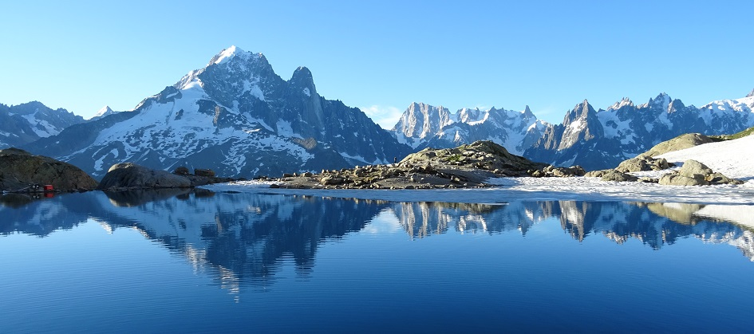
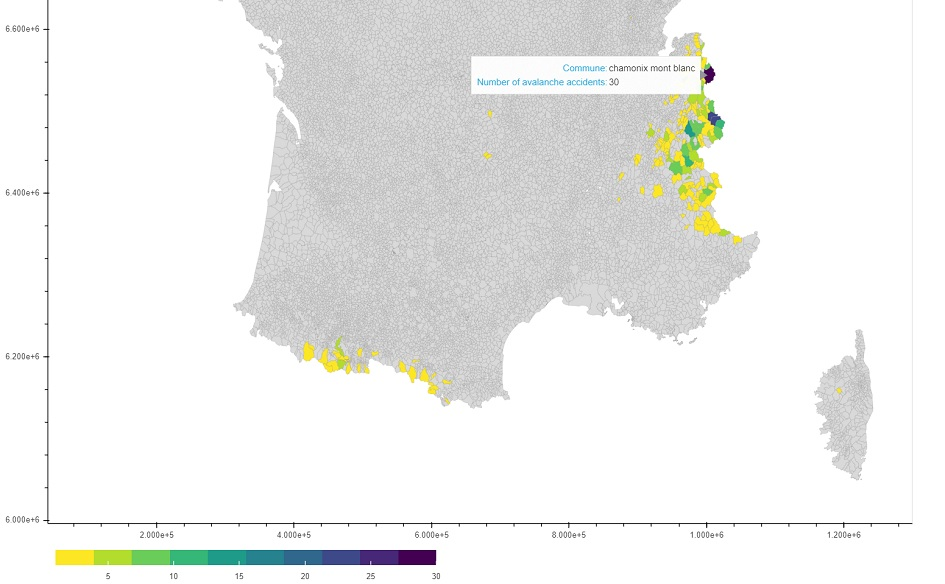

# Danger of avalanches in french mountains

## by Kamila Hamalcikova

View on Mont Blanc massif from Lac Blanc, source: Kamila Hamalcikova

## Dataset

My dataset is compilation of multiple Excel and pdf reports about occurence of avalanches in France from winter season 2010/11 till 2019/20. Original reports can be found on [ANENA (Association Nationale pour l’Étude de la Neige et des Avalanches)(https://www.anena.org/5041-bilan-des-accidents.htm) website. Over last 10 years there were 569 cases of avalanches in France where one or more people were involved.

## Installation

- Anaconda
- Jupyter Notebook
- Python 3.6
- Python libraries (Pandas, Numpy, Geopandas, Bokeh)

## Main findings

It is not a surprise that the highest mountains have also highest number of avalanche accidents, with commune Mont Blanc having 30 cases of avalanche incidents as a record in all communes (commune is administrative unit in France). Majority of cases appeared in French Alps and Pyrenees mountains, while we could observe some rare cases also in Corsica and in Massif du Sancy and Massif Central. Most important finding is interactive visualization of communes with avalanche accidents (preview below).

source: Kamila Hamalcikova

## License

This project is licensed under the MIT License - see the [license](https://opensource.org/licenses/MIT) file for details

## Sources

- [ANENA - for avalanche reports](https://www.anena.org/5041-bilan-des-accidents.htm#par42276)
- [data.gov.fr - for shapefile of France and its communes](https://www.data.gouv.fr/fr/datasets/decoupage-administratif-communal-francais-issu-d-openstreetmap/)
- [article A Complete Guide to an Interactive Geographical Map using Python by Shivangi Patel](https://towardsdatascience.com/a-complete-guide-to-an-interactive-geographical-map-using-python-f4c5197e23e0)
- [earthdatascience.org on dissolving polygons](https://www.earthdatascience.org/workshops/gis-open-source-python/dissolve-polygons-in-python-geopandas-shapely/)
- [GIS.stackechange on specifics of fillna function in geodataframes](https://gis.stackexchange.com/questions/287064/dissolve-causes-no-shapely-geometry-can-be-created-from-null-value-in-geopanda/287065)
